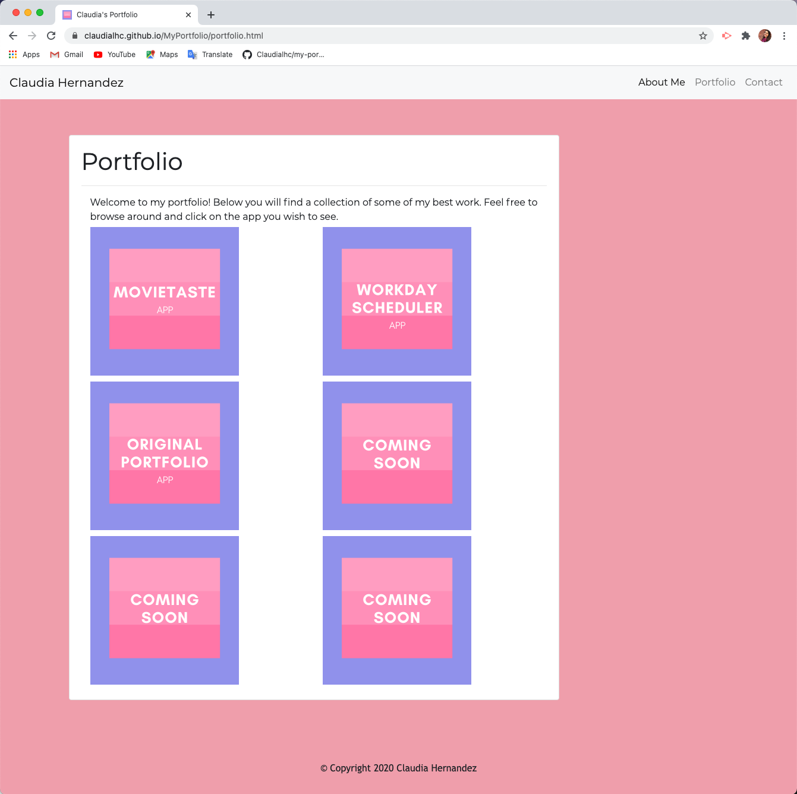

# MyPortfolio
This is my professional portfolio website. This is an updated version of my first portfolio version. In this updated version you will find links to my LinkedIn, GitHub and Resume. As well as links to 3 of the projects I have worked on. 

You can access each site by clicking on the desired page you'd like to visit, on the nav bar on the top of each site. By clicking the word you are trigerring the link the word is linked to, respectively, to take you to the desired page. If you find yourslf on either the "Portfolio", "Resume", any project page or "Contact" pages, and you want to go back to the "About Me" page you can do so by clicking either the "About Me" or "Claudia Hernandez" links located on the nav bar. 

On the "About Me" page you will find a profesional headshot of myself, along with a short bio and contact information. The phone number and emails shown on this page are fake, but, the link to my LinkedIn, GitHub and Resume buttons are links. I did this because at the moment I am not comfortable with people getting a hold of that personal information and if they wanted to get in contact they can just fill out the contact form. At the bottom of this, and all the other pages, you will find a sticky footer. 

When you click the "My Resume" button it takes you to another page that displays my current resume and underneath the resume there is a clickable button that allows you to download the resume. 

On the "Portfolio" page you will find three of the projects I have worked one and three "Coming Soon" placeholder images for future projects. Each project icon is linked to a page with the project information and links to the Repo and working app. Once on the "Porfolio" page just click on the project you would like to view. 

Here is an image of what the working portfolio looks like:

The three projects I decided to showcase are: 

<ul>
  <li>MOVIETASTE</li>
  <li>Work Scheduler</li>
  <li>Original Portfolio</li>
</ul>

The reason I decided to include my first portfolio in here because I wanted to display the advancement and imporovement I have made since. I think it is would be a great comparison between the new version and the old version. 

On the "Contact", you will find the contact form. This form can be used by potential and existing clients if they want to get in contact with me. At the moment the form is not linked to an email, but it will become enabled on the final porfolio.
 
Overall, you will find this template was made using bootstrap, HTML elements and CSS style. 

Deployed Link: https://claudialhc.github.io/MyPortfolio/